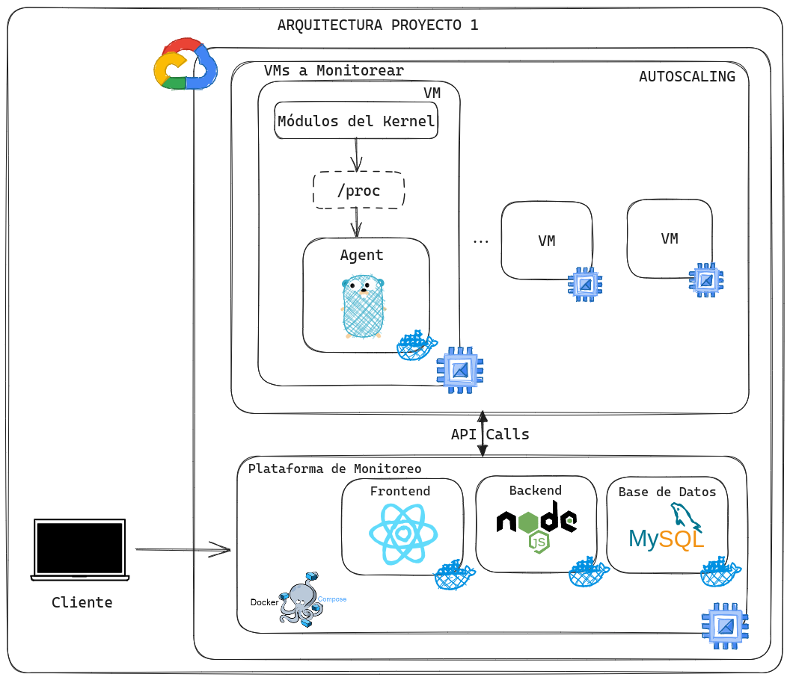
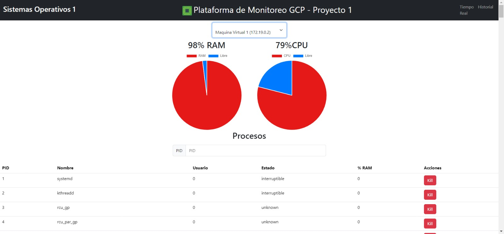
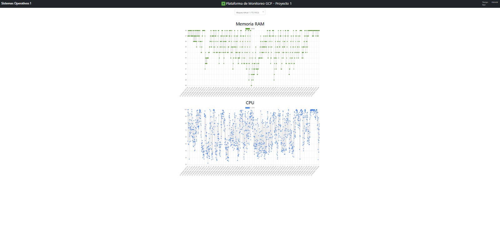
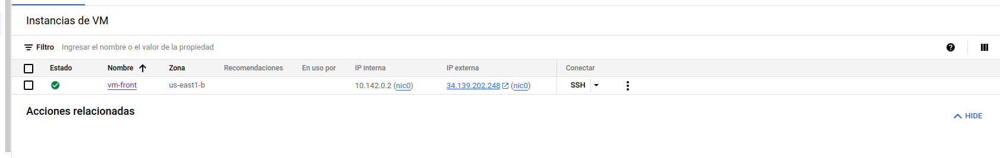

# 👨‍💻 Proyecto 1

```json
{
    "Universidad": "Universidad de San Carlos de Guatemala",
    "Facultad": "Facultad de Ingeniería",
    "Escuela": "Escuela de Ciencias y Sistemas",
    "Curso": "Sistemas Operativos 1",
    "Sección": "N",
    "Periodo": "Segundo Semestre 2023"
}
```
Creado por:

| Carnet | Nombre |
| ------ | ------ |
| 201900042 | Rodrigo Alejandro Hernández de León |

# Manual Técnico
## 📚 Contenido

1. [📃 Requerimientos](#Requerimientos)
    - [📍Tecnologías](#Tecnologías)
    - [📍Herramientas](#Herramientas)
2. [🚀 Arquitectura del Proyecto](#Arquitectura-del-proyecto)
3. [🖥 Flujo de la aplicación](#Flujo-de-la-aplicación)
    - [VMs a Monitorear](#VMs-a-Monitorear)
    - [Plataforma de Monitoreo](#Plataforma-de-Monitoreo)

## 📃 Requerimientos

- ### 📍Tecnologías
    - Docker
    - Docker Compose
    - Cuenta en dockerhub
    - Git
    - nodejs v18.17.1
    - npm v9.6.7
    - golang v20.7
    - Ubuntu 22.04 LTS
    - Google Cloud Platform( GCP )
    - GCP Compute Engine

- ### 📍Herramientas
    - Visual Studio Code
    - Postman
    - GitKraken
    - MySQL Workbench/DataGrip
    - Navegador web

## 🚀 Arquitectura del Proyecto



## 🖥 Flujo de la aplicación

- ### VMs a Monitorear

    - #### Módulos de Kernel

        - [Módulo CPU](./VM_Monitoreo/Modulos/cpu/): Este módulo fue creado en C y sirve para obtener la siguiente información:
            ```json
                {
                    "porcentaje_cpu":0, // que es un entero
                    "procesos":[ //array de procesos
                        {
                            "pid":0, // entero
                            "nombre":"nombre_del_proceso", // string
                            "usuario":"usuario", // string
                            "estado":"estado", // string
                            "porcentaje_ram":0, // entero
                        },
                        ...
                    ],
                }
            ```
            Este se instala teniendo en cuenta que se debe de tener instalado el compilador de C en la VM, para instalarlo se debe de ejecutar el siguiente comando:
            ```bash
                sudo apt install make
                sudo apt install build-essential
                sudo apt-get install manpages-dev
            ```
            Luego se debe de ejecutar el siguiente comando para compilar el módulo:
            ```bash
                make all
            ```
            Luego se inserta el módulo con el siguiente comando:
            ```bash
                sudo insmod cpu_201900042.ko
            ```
        - [Módulo RAM](./VM_Monitoreo/Modulos/ram/): Este módulo fue creado en C y sirve para obtener la siguiente información:
            ```json
                {
                    "Total_ram":0, // entero
                    "Ram_en_Uso":0, // entero
                    "Porcentaje_en_uso":0, // entero
                }
            ```
            Este se instala teniendo en cuenta que se debe de tener instalado el compilador de C en la VM, para instalarlo se debe de ejecutar el siguiente comando:
            ```bash
                sudo apt install make
                sudo apt install build-essential
                sudo apt-get install manpages-dev
            ```
            Luego se debe de ejecutar el siguiente comando para compilar el módulo:
            ```bash
                make all
            ```
            Luego se inserta el módulo con el siguiente comando:
            ```bash
                sudo insmod ram_201900042.ko
            ```

    - #### Agente
        - [Agente Golang](./VM_Monitoreo/API/): Este agente fue creado en Golang y sirve para obtener la información de los módulos de Kernel y enviarlos a la [Plataforma de Monitoreo](#Plataforma-de-Monitoreo) para que esta pueda almacenar la información en la base de datos. Tambien este agente puede ser llamado para ejecutar la `Kill` de un proceso por medio de su PID. Para ejecutar este Agente primero tiene que estar levantada la Plataforma de Monitoreo, luego se debe de ejecutar el siguiente comando:
            ```bash
                docker compose up
            ```
        O tambien con el siguiente comando:
        ```bash
            docker run -p 3000:3000 -d --name rodrialeh01/agente-backend
        ```
        En donde esta imagen se puede encontrar en Dockerhub en el siguiente [enlace](https://hub.docker.com/repository/docker/rodrialeh01/agente-backed).

        Para ejecutar la `Kill` de un proceso se debe de acceder a la siguiente ruta:
        ```bash
            http://{ip_vm}:3000/kill
        ```
        En donde `{ip_vm}` es la ip de la VM donde se encuentra el agente, y se debe de enviar un JSON con la siguiente estructura:
        ```json
            {
                "pid":0 // entero y PID del proceso a matar
            }
        ```

    - #### GCP Cloud Engine
        En esta parte se usa el servicio de GCP Cloud Engine donde se tendra contemplado una plantilla de VM donde se instalarán los modulos creados en C que se encuentran en la carpeta [Modulos](./VM_Monitoreo/Modulos/) y se ejecutarán en segundo plano para que puedan enviar la información a la [API de golang](./VM_Monitoreo/API/) que será levantada con la imagen de Docker utilizando el puerto `3000`.

        Esta plantilla de VM se utiliza para el Grupo de Instancias y se configuró el Autoscaling indicando la métrica de utilización a un 60%, como mínimo se tiene 1 instancia y máximo 4. Y dentro de cada instancia debe de estar alojado los módulos de Kernel y el Agente (que es la API de Golang) para permitir la comunicación con la Plataforma de Monitoreo.

        Se añadió un script de automatización a la plantilla la cual puede encontrarse en [script](./VM_Monitoreo/script_configuraciones.sh).

- ### Plataforma de Monitoreo

    - #### Frontend
        Hecho con la libreria de React en el cual es levantado en el puerto `5173` se compone de las siguientes vistas y lo puede encontrar en el siguiente [enlace](./Plataforma_Monitoreo/Frontend/):
        - Vista Tiempo Real: En esta vista lo que se muestra son los porcentajes de cpu y ram de la máquina virtual seleccionada en un gráfico de Pie, y tambien se muestra una tabla con los procesos que se encuentran en ejecución en la máquina virtual seleccionada y además cada proceso tiene su botón de `Kill` para matar ese proceso.Tambien puede buscar un proceso por su nombre o su PID.

            

        - Vista Historial: En esta vista se muestra un gráfico de Lineas en donde se muestra el historial de los porcentajes de cpu y ram de la máquina virtual seleccionada.

            

    - #### Backend

        Api desarrollada en NodeJS donde se encarga de recibir la información del agente de Golang y almacenarlos en la base de datos, tambien se encarga de recibir las peticiones de la vista de Tiempo Real para obtener la información de los porcentajes de cpu y ram de la máquina virtual seleccionada y tambien se encarga de recibir las peticiones de la vista de Historial para obtener el historial de los porcentajes de cpu y ram de la máquina virtual seleccionada, se levanta con el puerto `4000`. Esta API se encuentra en el siguiente [enlace](./Plataforma_Monitoreo/Backend/).

        Los Endpoints de esta API son los siguientes:

        | Endpoint | Método | Descripción |
        | -------- | ------ | ----------- |
        | / | `GET` | Muesta un mensaje de que se levanto la API correctamente |
        | /datos | `POST` | Recibe la información del agente de Golang y la almacena en la base de datos |
        | /ips | `POST` | Recibe la ip de la máquina virtual seleccionada y las guarda |
        | /vms | `GET` | Obtiene todas las máquinas virtuales que se encuentran guardadas en la api |
        | /kill | `POST` | Recibe el pid del proceso a matar y llama al agente para matar el proceso |
        | /historial | `POST` | Recibe la ip de la máquina virtual seleccionada y obtiene el historial de los porcentajes de cpu y ram de esa máquina virtual |
        | /procesos | `POST` | Recibe la ip de la máquina virtual seleccionada y obtiene los procesos que se encuentran en ejecución en esa máquina virtual |
    
    - #### Base de Datos

        Creada con una imagen de docker de `mysql` en la cual se encuentra en el puerto `3306`. Y maneja una base de datos con el nombre de `proyecto1_so1` donde contiene una tabla llamada `modulo` y almacena lo siguiente:
        - id: entero autoincrementable
        - ip: string
        - porcentaje_cpu: entero
        - porcentaje_ram: entero
        - fecha_hora: datetime

    - #### Ejecución en Docker Compose
        Para ejecutar la plataforma de monitoreo se debe de ejecutar el siguiente comando:
        ```bash
            docker compose up
        ```
        En la siguiente [ubicacion](./Plataforma_Monitoreo/).

    - #### GCP Compute Engine
        Se creó una instancia en donde alojara estos contenedores y con el docker compose poder levantarlos. Esta instancia se encuentra en el siguiente [enlace](http://34.139.202.248:5173/).

        
