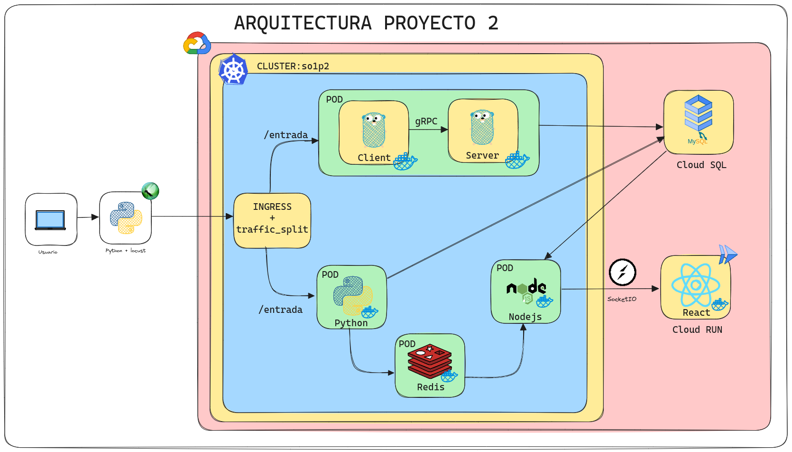

# 👨‍💻 Proyecto 2

```json
{
    "Universidad": "Universidad de San Carlos de Guatemala",
    "Facultad": "Facultad de Ingeniería",
    "Escuela": "Escuela de Ciencias y Sistemas",
    "Curso": "Sistemas Operativos 1",
    "Sección": "N",
    "Periodo": "Segundo Semestre 2023"
}
```
Creado por:

| Carnet | Nombre |
| ------ | ------ |
| 201900042 | Rodrigo Alejandro Hernández de León |

# Manual Técnico
## 📚 Contenido

1. [📃 Requerimientos](#Requerimientos)
    - [📍Tecnologías](#Tecnologías)
    - [📍Herramientas](#Herramientas)
2. [🚀 Arquitectura del Proyecto](#Arquitectura-del-proyecto)
3. [🖥 Flujo de la aplicación](#Flujo-de-la-aplicación)
    - [JSON de entrada](#JSON-de-entrada)
    - [API Python](#API-Python)
    - [gRPC](#gRPC)
    - [API NodeJS](#API-NodeJS)
    - [BD Redis](#BD-Redis)
    - [BD MySQL](#BD-MySQL)
    - [Frontend](#Frontend)
    - [Locust](#Locust)
    - [Kubernetes](#Kubernetes)
    - [GCP](#GCP)

## 📃 Requerimientos

- ### 📍Tecnologías
    - Docker
    - GPC Cloud SDK
    - Cuenta en dockerhub
    - Git
    - nodejs v18.17.1
    - npm v9.6.7
    - golang v20.7
    - python v3.10.12
    - Ubuntu 22.04 LTS
    - Google Cloud Platform( GCP )
    - GCP Cloud Run
    - Google Kubernetes Engine (GKE)
    - Locust
    - Redis

- ### 📍Herramientas
    - Visual Studio Code
    - Postman
    - GitKraken
    - MySQL Workbench/DataGrip
    - Lens
    - Navegador web

## 🚀 Arquitectura del Proyecto



## 🖥 Flujo de la aplicación

- ### JSON de entrada
Este es un ejemplo del json que tiene de entrada en el trafico de entrada al cluster.
```json
{
    "carnet": 201900042,
    "nombre": "Rodrigo",
    "curso": "SO1",
    "nota": 100,
    "semestre": "2S",
    "year": 2023
}
```

- ### API Python

    Es la api en la cual se encarga del 50% del trafico de entrada donde con su endpoint `/entrada` y en el puerto `4000` entra el trafico de entrada y se encarga de enviarlo a la base de datos de redis y posteriormente a la base de datos de Cloud SQL.

- ### gRPC

    Es el protocolo de comunicación donde recibe el otro 50% del trafico de entrada donde entra un cliente gRPC de golang y se lo envia al servidor gRPC de golang y este se encarga de enviarlo a la base de datos de Cloud SQL.

- ### API NodeJS

    Es la api en la cual se encarga de enviar la información estática de la base de datos en Cloud SQL por medio del protocolo `http` y de enviarle los datos en tiempo real de redis por medio del protocolo de sockets a un Frontend ubicado en Cloud RUN.

- ### BD Redis
    Es la base de datos en la cual se encarga de guardar los datos en tiempo real de la api de python y de enviarlos a la api de nodejs.

- ### BD MySQL
    Es la base de datos en la cual se encarga de guardar los datos que obtiene desde golang y python y de enviarlos a la api de nodejs alojado en Cloud SQL.

- ### Frontend
    Es la aplicación en la cual se encarga de mostrar los datos en tiempo real de la base de datos de redis y de mostrar los datos estáticos de la base de datos de Cloud SQL hecha en Reactjs.

- ### Locust
    Es la herramienta en la cual se encarga de simular el trafico de entrada al cluster donde en ella contiene un archivo de python para enviar la información.

- ### Kubernetes

    Cluster creado en GKE donde contiene lo siguiente:

    - [**INGRESS + traffic_split:**](./../../k8s/ingress/) Es el balanceador de carga que se encarga de enviar el trafico de entrada al cluster y repartirlo en 50% a gRPC y el otro 50% a Python.

    - [**PODS:**](./../../k8s/pods/) Son los pods que contienen las imagenes de los contenedores de gRPC, Python, NodeJS, Redis y MySQL.

    - [**SERVICES:**](./../../k8s/services/) Son los servicios que se encargan de exponer los pods al cluster.

    - [**NAMESPACES:**](./../../k8s/namespaces/) Son los namespaces que se encargan de mantener en un mismo espacio todo el cluster.

    - [**SECRETS:**](./../../k8s/secrets/) Son los secretos que se encargan de guardar las variables de entorno que necesita cada pod.

    - [**HPA**](./../../k8s/hpa/) Es la configuración del Horizontal Pod Autoscaling teniendo como minimo 1 replica y un máximo de 3 replicas.

- ### GCP

    Servicio de cloud el cual se utilizaron los siguientes servicios:
    1. Cloud Run
    2. Cloud SQL
    3. Kubernetes Engine
