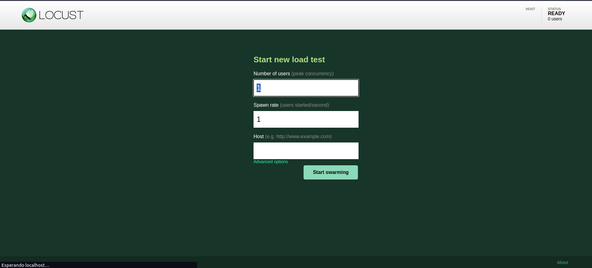
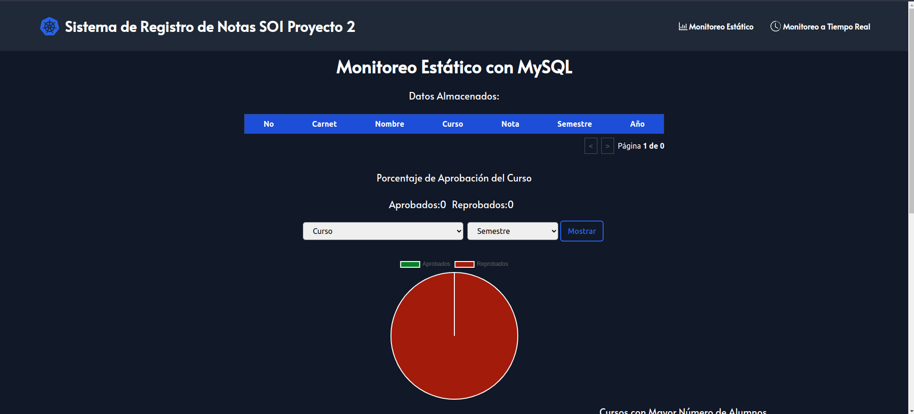
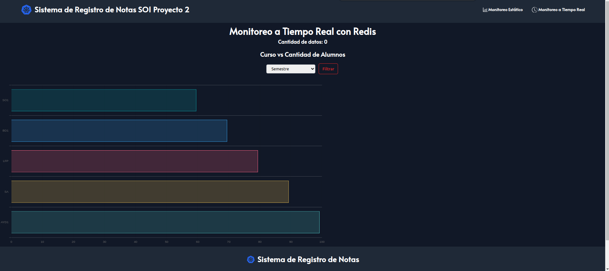

# 👨‍💻 Proyecto 2

```json
{
    "Universidad": "Universidad de San Carlos de Guatemala",
    "Facultad": "Facultad de Ingeniería",
    "Escuela": "Escuela de Ciencias y Sistemas",
    "Curso": "Sistemas Operativos 1",
    "Sección": "N",
    "Periodo": "Segundo Semestre 2023"
}
```
Creado por:

| Carnet | Nombre |
| ------ | ------ |
| 201900042 | Rodrigo Alejandro Hernández de León |

# Manual de Usuario
## 📚 Contenido

1. [🚀 Generación de trafico](#Generación-de-trafico)
2. [🖥 Aplicación Web](#Aplicación-Web)

## 🚀 Generación de trafico

Para poder generar trafico usando Locust es necesario previamente tener instalado Locust y contar con un array de jsons de este formato:

```json
{
    "carnet": 201900042,
    "nombre": "Rodrigo",
    "curso": "SO1",
    "nota": 100,
    "semestre": "2S",
    "year": 2023
}
```

Posteriormente en el archivo donde esta el [`main.py`](./../../Traffic/main.py) cambiar el nombre del archivo al archivo donde se aloje ese array de json y luego ejecutar el siguiente comando:

```bash
locust -f main.py
```
Luego abre en el navegador `localhost:8089` y se te abrira la siguiente ventana:



Posteriormente ingresas cuanta cantidad de trafico y cuantos usuarios quieres que generen trafico y la ip la cual es: [` http://35.237.246.60.nip.io`](http://35.237.246.60.nip.io).

## 🖥 Aplicación Web

Para poder acceder a la aplicación web es necesario ingresar a la siguiente dirección: [`https://frontso1p2-uwswyrwatq-ue.a.run.app/`](https://frontso1p2-uwswyrwatq-ue.a.run.app/)

Donde encontrara la siguiente interfaz:



Donde podra ver todos los datos que se guardaron, teniendo 3 diferentes tipos de reportes a visualizar.

Tambien puede ir al apartado de Tiempo real donde visualizara a tiempo real como ingresa el trafico de datos por medio de una grafica la cual la puede filtrar por semestre.

