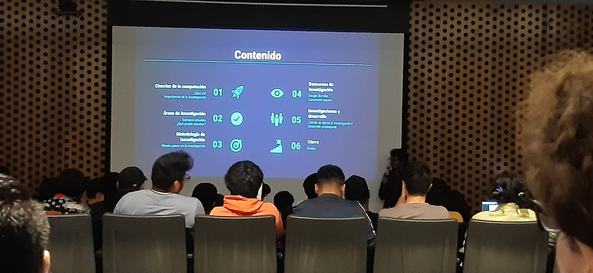
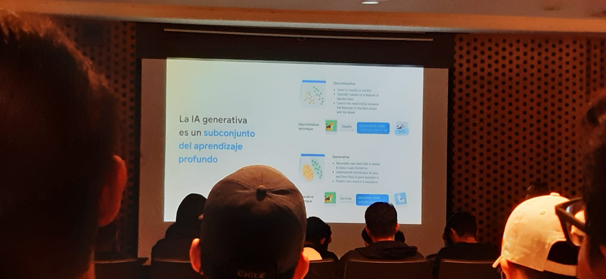
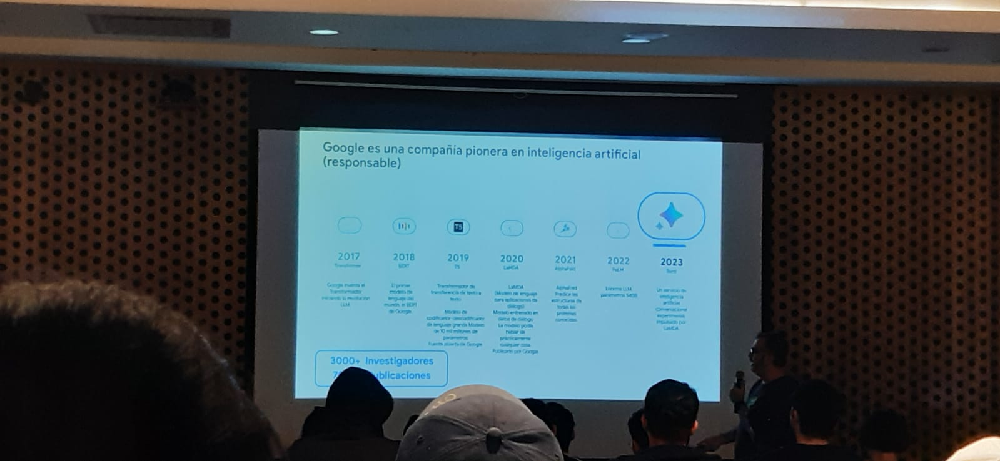
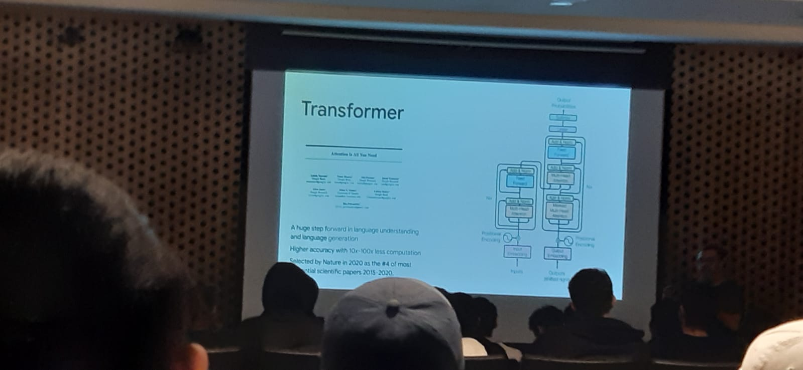
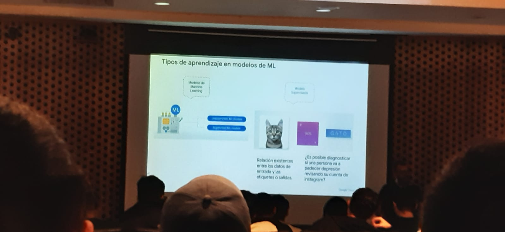
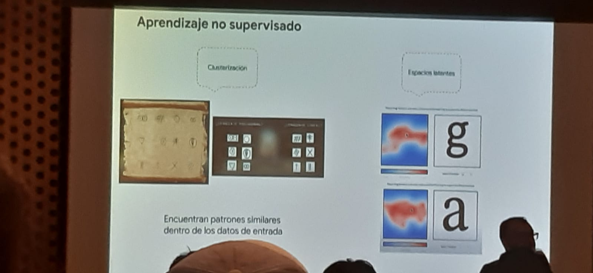
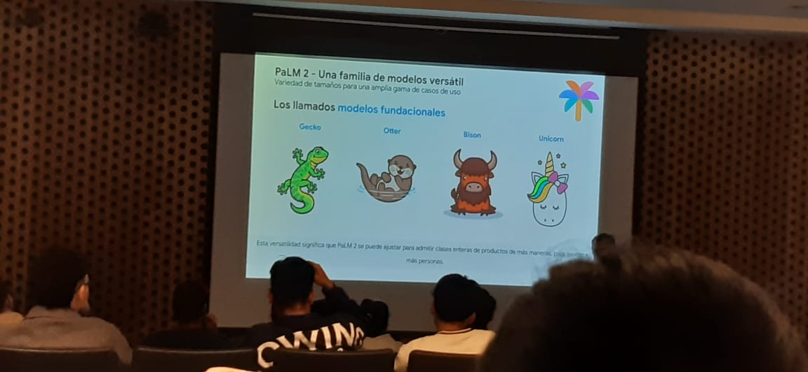
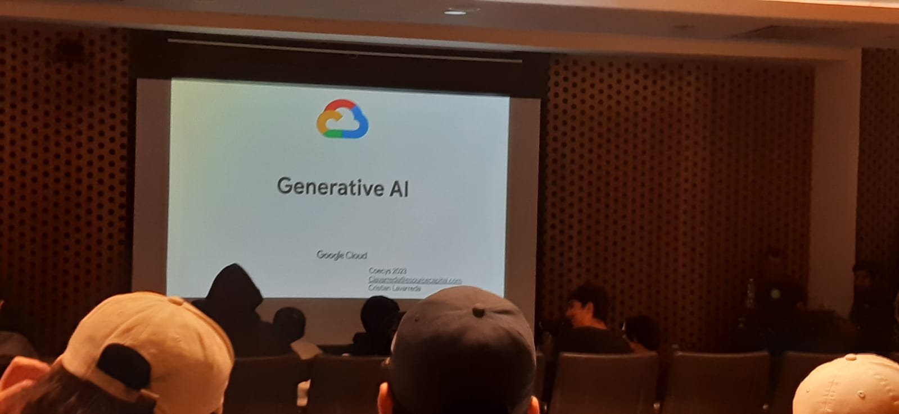

# 📝 Ensayo COECYS

## La Investigación de las Ciencias de la Computación

### Conferencista
- Ing Kevin Lajpop

### Ensayo del tema
La conferencia habla de como la investigación es parte fundamental para poder ser un científico y más en el caso de las ciencias de la computación, donde muchas grandes empresas necesitan de muchos científicos, y para demostrar que uno es científico debe de publicar distintos artículos científicos, y para poder publicar estos artículos se necesita de investigación. En nuestra Universidad hay mucha escasez de artículos cientificos, por falta de impulso en la innovación cientifica de publicar artículos cientificos, hoy en dia se puede encontrar la información en internet lo cual llega as er una buena herramienta asi tambien como tomar de los articulos desde Scihub donde es mas facil de acceder al articulo cientifico. Asi tambien todo esto va por un proceso de aprendizaje y desarrollo no solo personal sino tambien puede ser parte de un logro para la universidad y para el pais. Se invita a poder investigar y publicar articulos cientificos para poder ser un cientifico si uno se interesa en estas ramas y poder asi seguir investigando e innovando en base a las investigaciones realizadas. 

## AI Generativa

### Conferencista
- Ing Cristian Lavarreda

### Ensayo del tema

La conferencia habla desde como se usa la inteligencia artificial en base a 2 puntos que son:
- __Discriminativa__: Esto quiere decir que pueda distiguir la diferencia entre los objetos y los pueda clasificar, en base a una base de datos que se le proporciona al modelo para que pueda aprender y asi poder clasificar los objetos.

- __Generativa__: Esto quiere decir que la inteligencia artificial debe de poder encontrar patrones los cuales luego de encontrarlos pasa por un modelo transformer que lo orienta por mediod e modelos matematicos a la semantica de lo solicitado por el usuario, y asi poder generar una nueva respuesta que ya se genera en base a los modelos planteados.

El primer paper fue de google para la Inteligencia Artificial que fue acerca de los transformers que hoy en dia es usado y citado por mas de 3000 investigaciones y mas de 7000 publicaciones.

Google Cloud Plataform cuenta con servicios de inteligencia artificial generativa el cual ayuda a la creación de bots que puedan entender o simular el comportamiento de lo que se quiera simular.

La IA cuenta con distintas herramientas que son:
- __Modelos Supervisados__: Esto quiere decir que se le da un conjunto de datos para que pueda aprender y asi poder clasificar los objetos. Y tambien pueda etiquetar esos objetos o datos.

- __Modelos No Supervisados__: Esto quiere decir que tiene que encontrar patrones en los datos que se le proporciona y asi poder dar una salida a la generación de nuevos datos u objetos.

Y algo muy importante ante toda la IA Generativa es siempre adoptar los parametros al modelo

