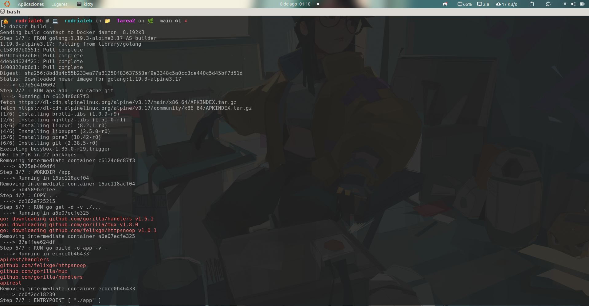
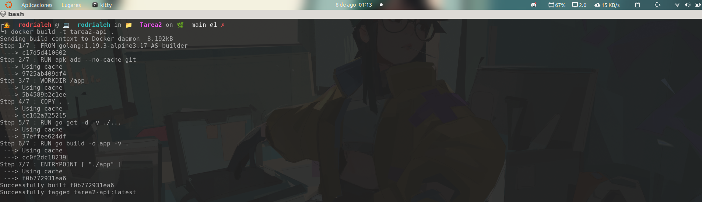
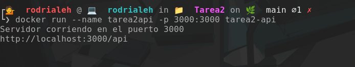
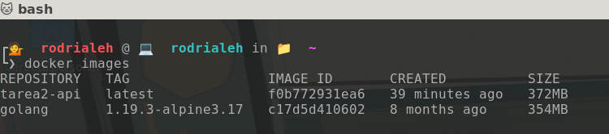
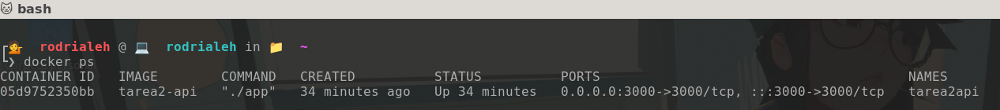
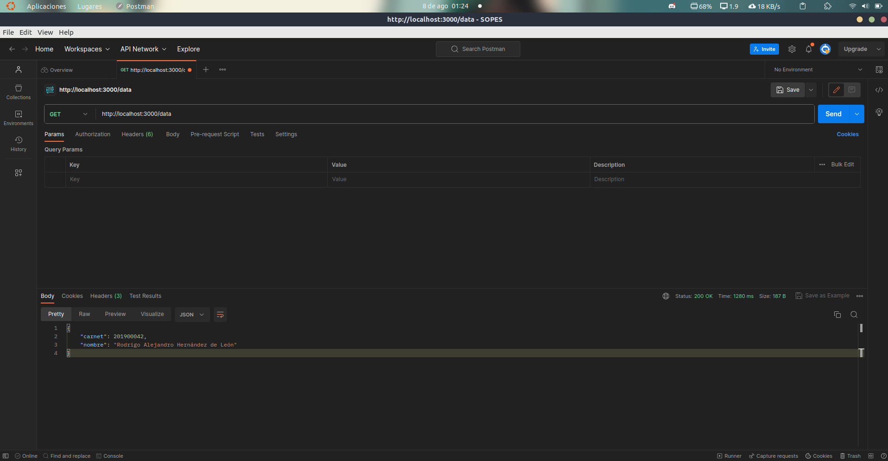

# 📝 Tarea 2

| Nombre | Carné |
| ------ | ----- |
| Rodrigo Alejandro Hernández de León | 201900042 |

## Descripción
Realizar una API utilizando el lenguaje de programación Go que contenga el endpoint `/data`. Este endpoint estará diseñado para retornar los datos de un estudiante, incluyendo su número de carnet y nombre en formato JSON. La API será dockerizada para facilitar su despliegue. Además, se utilizará Postman para consumir el endpoint y verificar que los datos se obtienen correctamente.

## Solución

### 🐳 Creación de la imagen de docker

Posicionado en la carpeta de `Tarea2`

Comando: `docker build .`

### 🐳 Ponerle nombre a la imagen de docker

Posicionado en la carpeta de `Tarea2`

Comando: `docker build -t tarea2-api .`

### 🐳 Correr la imagen de docker

Comando: `docker run --name tarea2api -p 3000:3000 tarea2-api`

### 🐳 Ver la imagen creada

Comando: `docker images`

### 🐳 Ver si esta corriendo

Comando: `docker ps`

### 🐳 Petición en Postman

Se realizó la petición con la siguiente URL: `http://localhost:3000/data`

