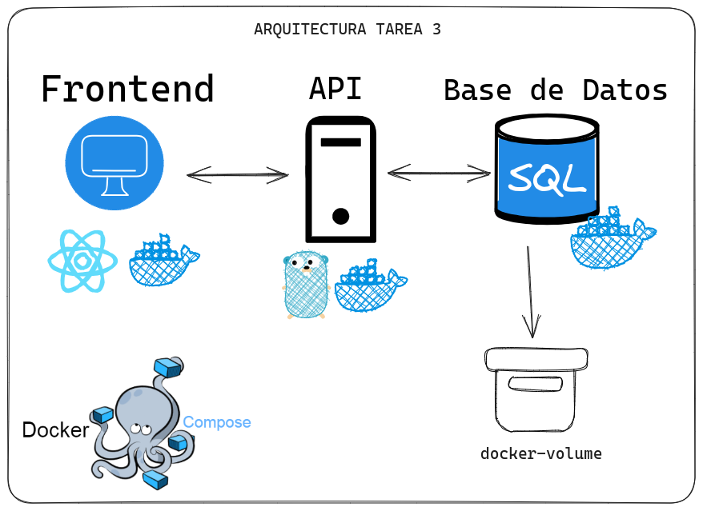
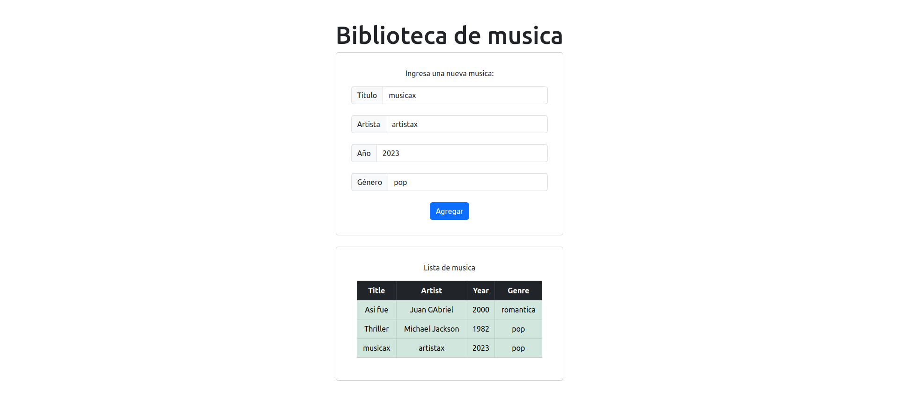

# Tarea 3

# 🐳 Docker Compose y Docker Volumes

## Descripción

Realizar una aplicación multicontainers compuesta por 3 contenedores:
- Api (golang)
- Frontend (react)
- Base de Datos (mysql)
Y se le pide realizar una aplicación web para ingreso de datos de una biblioteca
musical, así mismo que se puedan visualizar los datos ingresados. Los datos deben
guardarse en una base de datos MySQL y se pide guardar los datos de forma
persistente. Toda la aplicación debe estar contenerizada por docker-compose.

Los datos que pide la biblioteca son:
1. Título de álbum
2. Artista
3. Año de lanzamiento
4. Género musical

## Arquitectura



## Solución

### Video de la solución final

[https://youtu.be/APMdsnrzekQ](https://youtu.be/APMdsnrzekQ)

### API - Backend

El backend fue desarrollado en Golang, teniendo el puerto para la api `3000`, y para acceder a ella solo escriba `localhost:3000` en su navegador. En la cual dicha API contiene los siguientes endpoints:

| Endpoint | Método | Descripción |
| --- | --- | --- |
| `/`   | GET | Retorna un mensaje de bienvenida |
| `/musica` | POST | Crea un nuevo registro de música |
| `/biblioteca` | GET | Retorna todos los registros de música |

Donde la API al crear un registro necesita el siguiente JSON:
```json
{
    "titule": "titulo",
    "artist": "artista",
    "year": 2021,
    "genre": "genero"
}
```

### Base de Datos - Backend

El DBMS que se usó de base de datos es *Mysql* y se encuentra en el puerto `3306`. En la cual dicha base de datos fue nombrada como `bibliotecaa` en la cual contiene la tabla `musica` con los siguientes campos:

| Campo | Tipo | Descripción |
| --- | --- | --- |
| `id` | `int` | Identificador único del registro |
| `titule` | `varchar(100)` | Título del álbum |
| `artist` | `varchar(100)` | Nombre del artista |
| `year` | `int` | Año de lanzamiento del álbum |
| `genre` | `varchar(100)` | Género musical del álbum |

### Frontend

El frontend fue desarrollado en React, teniendo el puerto `5173`, y para acceder a ella solo escriba `localhost:5173` en el navegador. Y encontrara la siguiente pagina:

