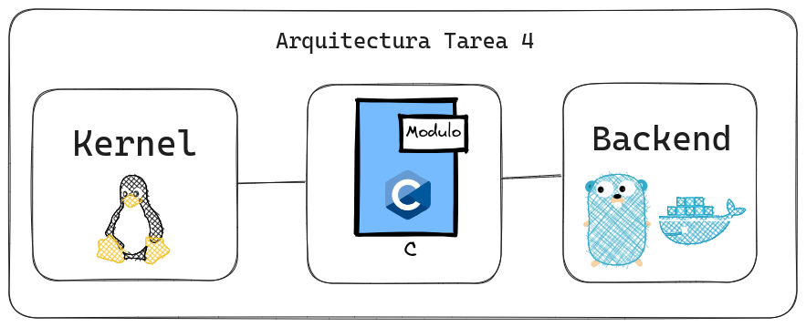

# Tarea 4

# 🧑‍💻 Módulos de Kernel

## Descripción

Realiza un Módulo escrito en C, que sea capaz de obtener la información de la
memoria RAM, este debe de estar dentro de la carpeta “/proc”, para posteriormente
leerlo con Golang. El backend lee el módulo cada cierto tiempo es decir debe de
actualizarse y este debe de dockerizarse

### Módulos por implementar

Módulo de Memoria RAM: El módulo debe sobreescribir un archivo en el directorio
/proc

### Datos a obtener
- Total de Ram
- Memoria Ram en Uso
- Memoria Ram Libre
- Porcentaje de Uso

### Características
- Importar librería `<sys/sysinfo.h>` (la cual fue sustituida por `<linux/sysinfo.h>`)
- Al cargar el Módulo (insmod) debe imprimirse el número de carnet.
- Al descargar el Módulo (rmmod) debe de mostrar el nombre del estudiante.
- La información que se mostrará en el módulo debe ser obtenida por medio de
los struct de información del sistema operativo y no de la lectura de otro
archivo o comandos de consola.
- El nombre del módulo será: `ram_<<carnet>>`

### Arquitectura



## Solución

### Video de la solución final

[https://youtu.be/WY8tVVkGuvg](https://youtu.be/WY8tVVkGuvg)

### API - Backend

El backend fue desarrollado en Golang donde se encuentra en la carpeta [`src/backend`](./src/backend/), teniendo el puerto para la api `3000`, y para acceder a ella solo escriba `localhost:3000` en su navegador. En la cual dicha API contiene los siguientes endpoints:

| Endpoint | Método | Descripción |
| --- | --- | --- |
| `/`   | GET | Retorna un mensaje de bienvenida |
| `/ram` | GET | Retorna la información de la memoria RAM |

La información que obtiene de la RAM se obtiene con el siguiente JSON:
```json
{
    "total_ram": 0,
    "ram_en_uso": 0,
    "ram_libre": 0,
    "porcentaje_en_uso": 0
}
```
Donde para levantar la imagen de docker se ingresa el siguiente comando:

- Sin la imagen de docker (posicionandose en la carpeta `src/backend`):
```bash
docker build -t api-t4 .
```
- Con la imagen de docker:
```bash
docker run --name api-t4 -p 3000:3000 api-t4
```

### Módulo de Kernel

El módulo de kernel fue desarrollado en C, en la cual se encuentra en la carpeta [`src/ram_modules`](./src/ram_modules/) y se llama `ram_201900042.c`. En la cual se puede compilar con el siguiente comando:

```bash
make all
```

Posteriormente se debe de cargar el módulo con el siguiente comando:

```bash
sudo insmod ram_201900042.ko
```

Y para ver los mensajes del módulo se usa el siguiente comando:

```bash
sudo dmesg
```

Donde al cargar el modulo se muestra el carnet que en este caso es `201900042`.

Y para descargar el módulo se usa el siguiente comando:

```bash
sudo rmmod ram_201900042
```

Donde al descargar el modulo se muestra el nombre del estudiante que en este caso es `Rodrigo Alejandro Hernández de León`.

Y si quiere ver el archivo que se sobreescribe en `/proc` se usa el siguiente comando:

```bash
cat /proc/ram_201900042
```


