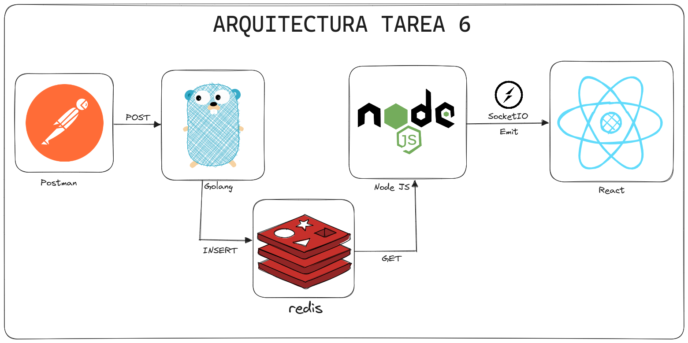

# Tarea 6

# 🔌 Redis y SocketIO

## Descripción

Realizar un servidor utilizando socket.io con Node y ReactJS para una aplicación en tiempo real que permita ingresar datos de álbumes de música desde una api de Golang a una base de datos en Redis. Los datos pueden ser enviados desde Postman y deben ser consumidos por Node que a su vez los reflejará en ReactJS.

Los datos a enviar tendrán la siguiente estructura:

```json
{
    "album":"nombre_del_album",
    "artist":"nombre_del_artista",
    "year":"año_del_album"
}
```

Ejemplo:

```json
{
    "album":"The Dark Side of the Moon",
    "artist":"Pink Floyd",
    "year":"1973"
}
```

## Arquitectura



## Solución

### Video de la solución final

[https://youtu.be/yf8De5xO8lo](https://youtu.be/yf8De5xO8lo)

### API - Golang

El backend fue desarrollado en Golang, teniendo el puerto para la api `3000`, y para acceder a ella solo escriba `localhost:3000` en su navegador. En la cual dicha API contiene los siguientes endpoints:

| Endpoint | Método | Descripción |
| --- | --- | --- |
| `/api`   | GET | Retorna un mensaje de bienvenida |
| `/api/album` | POST | Agrega un nuevo album a la base de datos de redis |
| `/api/albumes` | GET | Retorna todos los albumes de la base de datos de redis |

### Base de Datos - Redis

El DBMS que se usó de base de datos es *Redis* y se encuentra en el puerto `6379`. En la cual dicha base de datos guarda lo siguiente:

| Key | Descripción |
| --- | --- |
| `contador_album` | El contador de albumes |
| `album@`| Donde @ es el no. de album y guarda la estructura del json del album|

### API - NodeJS

El backend fue desarrollado en NodeJS, teniendo el puerto para la api `4000`, y para acceder a ella solo escriba `localhost:4000` en su navegador. Fue desarrollado con express y SocketIO En la cual dicha API contiene los siguientes endpoints:

- Express:
    | Endpoint | Método | Descripción |
    | --- | --- | --- |
    | `/`   | GET | Retorna un mensaje de bienvenida |
    | `/albumes` | GET | Obtiene todos los albumes desde la BD de redis |

- SocketIO:
    | Evento | Descripción |
    | --- | --- |
    | `getAlbumes` | Llama a la funcion donde retornara los albumes de redes a cada 500 ms |
    | `album` | Retorna la lista de albumes |

### Frontend - ReactJS

El frontend fue desarrollado en ReactJS con vite, teniendo el puerto `5173`, y para acceder a ella solo escriba `localhost:5173` en su navegador y mostrará la siguiente interfaz:


Donde se actualizara a tiempo real cada vez que se agrega un nuevo album.