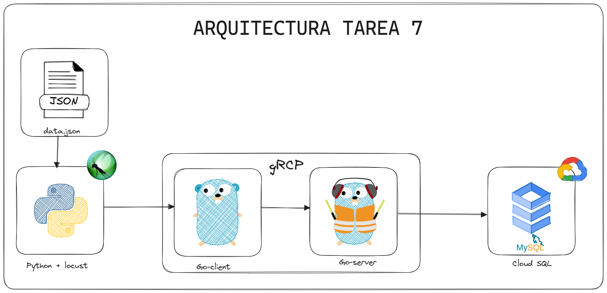

# Tarea 7

# 🦟 Locust y gRPC

## Descripción

Realizar un sistema cliente-servidor de tipo gRPC en golang, en el cual se puedan visualizar datos (del proyecto 2) enviados desde el generador de tráfico locust construído con python; los datos deben estar en formato JSON.
Posteriormente deben guardarse en una base de datos de Cloud SQL y los datos deben ser mostrados en un cliente.

Los datos a enviar tendrán la siguiente estructura:

```json
{
    "Carnet": 0, //no_carnet
    "Nombre": "nombre_estudiante", //nombre del estudiante
    "Curso": "iniciales_curso", //Unicamente puede ser BD1,SO1, LFP, SA o AYD1
    "Nota": 0, //Unicamente puede ser 50,60,70,80,90 o 100
    "Semestre": "iniciales_semestre", //Puede ser 1S o 2S
    "Year": 2023 //Unicamente puede ser 2023
}
```

Ejemplo:
```json
{
    "Carnet": 202248849,
    "Nombre": "Sofia",
    "Curso": "BD1",
    "Nota": 80,
    "Semestre": "1S",
    "Year": 2023
}
```

## Arquitectura



## Solución

### Video de la solución final

[https://youtu.be/_5C8CW9yzgQ](https://youtu.be/_5C8CW9yzgQ)

### Client - Golang

El cliente fue desarrollado en Golang, teniendo el puerto para la api `4000`, y para acceder a ella solo escriba `localhost:4000/api` en su navegador. En la cual dicha API contiene los siguientes endpoints:

| Endpoint | Método | Descripción |
| --- | --- | --- |
| `/api`   | GET | Retorna un mensaje de bienvenida |
| `/api/insertar` | POST | Agrega un nuevo estudiante y lo envia al Server por medio de gRPC|

### Server - Golang

El servidor fue desarrollado en Golang, teniendo el puerto para la api `3000`, y para acceder a ella solo escriba `localhost:3000`. En la cual dicha API obtiene los datos enviados por el cliente por medio de gRPC y los guarda en la base de datos de Cloud SQL.

### Base de datos - Cloud SQL

La base de datos fue desarrollada en Cloud SQL, en la cual se guardan los datos enviados por el cliente por medio de gRPC. En la cual al conectarse a la base de datos, hay que ejecutar primero el siguiente [script](./script/script.sql):

```sql
CREATE DATABASE IF NOT EXISTS sistemanotas;

CREATE TABLE IF NOT EXISTS sistemanotas.alumno (
    id INT NOT NULL AUTO_INCREMENT,
    carnet BIGINT NOT NULL,
    nombre VARCHAR(50) NOT NULL,
    curso VARCHAR(4) NOT NULL,
    nota INT NOT NULL,
    semestre VARCHAR(2),
    year INT,
    PRIMARY KEY (id)
);
```

### Traffic Generator - Python

El generador de tráfico fue desarrollado en Python, con el apoyo de locust, el cual de forma aleatoria envia los datos de [datos.json](./Traffic/datos.json) y la ejecución de este se realiza con el comando `locust -f main.py` desde la carpeta de [Traffic](./Traffic/) y se puede acceder a él por medio de `localhost:8089`.